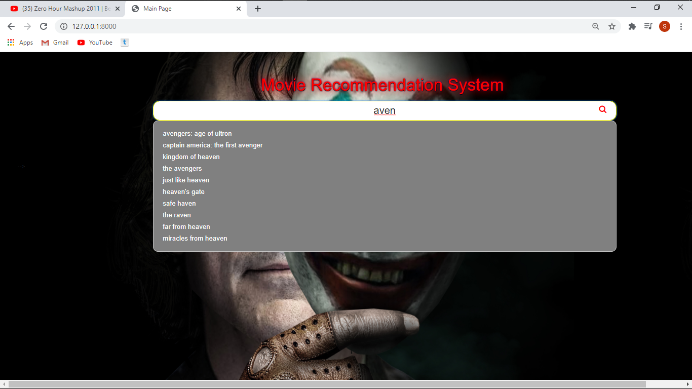
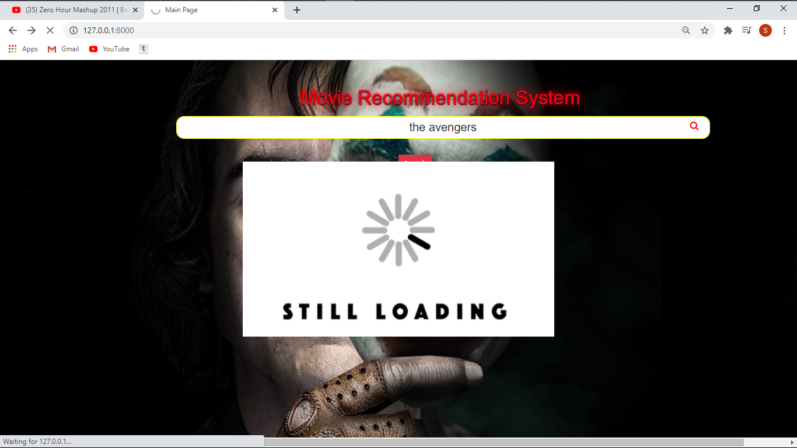

# Movie Recommendation System

# Dataset Used
(1) kaggle movie dataset for data upto 2016
(2) scrapped data from wikipedia for movies upto 2020
(3) used tmdb3api of IMDB website to fetch details of movie,
director, collection, actors

# For Recommendataion
(1) count vectorizer used
(2) cosine similiarity after the above 

# Screenshots of Website

# (1) Home

# (2) Auto Complete Suggestions

# (3)loaders

# (4)movie Detail

# (4)Top Cast

# (5)Cast Detail
  
